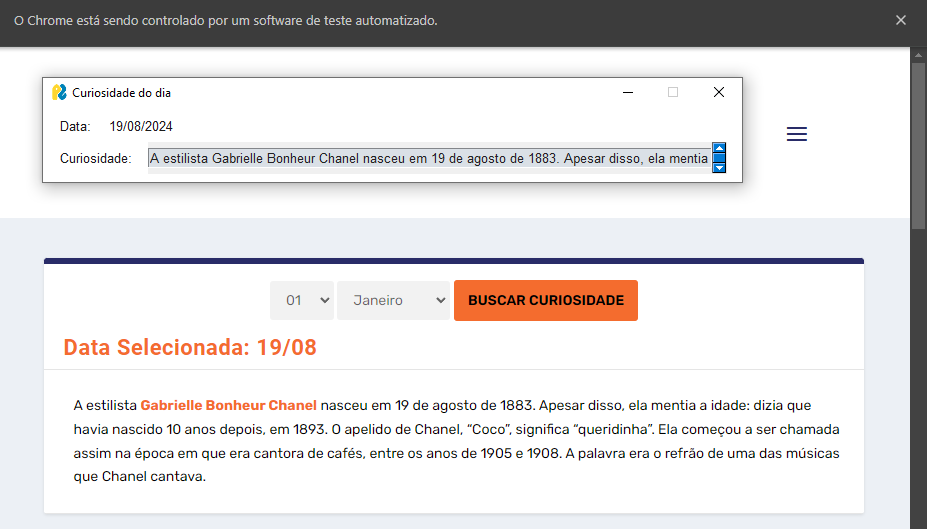

# curiosity-scraping

28/05/2025
-
Em 1987, na Costa Rica, foi realizado o V Encontro Internacional da Mulher e da Saúde. Durante o evento foram discutidas questões relacionadas à morte de mulheres durante a gravidez, o parto, o pós-parto e decorrentes de abortos malfeitos. Logo depois do encontro, em uma reunião realizada no dia 28 de maio, 80 mulheres de várias nacionalidades instituíram esse dia como Dia de Ação pela Saúde da Mulher. Uma vez que o primeiro tema discutido foi a morte materna, a data também é lembrada como o Dia Mundial Contra a Mortalidade Materna. Após essa iniciativa, a campanha foi assumida por vários países e associações internacionais. O tema muda a cada dois anos, mas está sempre relacionado à saúde sexual e reprodutiva da mulher.
