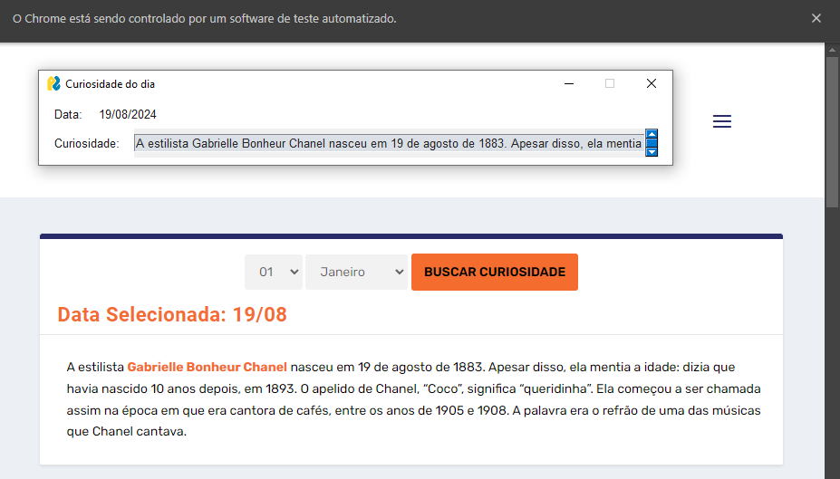

# curiosity-scraping

13/04/2026
-
Hoje é aniversário do humorista Chico Anysio. Em 1948, ele participou dos concursos para locutor e radioator da Rádio Guanabara. No teste para locutor, ficou em segundo lugar; perdeu para Silvio Santos. Para radioator, terminou em sétimo lugar. O concurso foi ganho por Fernanda Montenegro.
